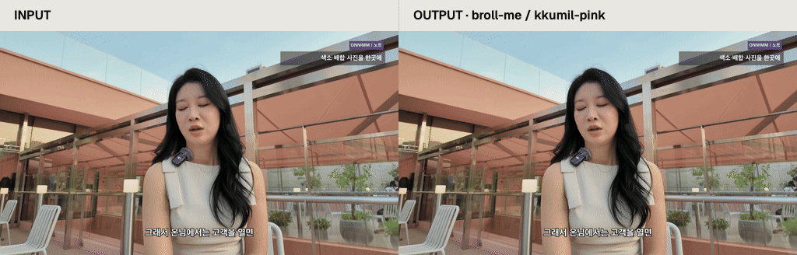

[](docs/assets/pink-demo.html)

[로컬에서 비교 재생](docs/assets/pink-demo.html) · [입력 MP4](docs/assets/pink-demo-input.mp4) · [결과 MP4](docs/assets/pink-demo-output.mp4) · [정지 이미지](docs/assets/pink-demo-comparison.png)

[English](README.md) · [한국어](README.ko.md)

# broll-me

Skill 하나를 설치한 뒤 Codex나 Claude Code에 요청하세요. 제공한 문구로 모션 그래픽 B-roll을 만들고, 원하는 팔레트를 카드, terminal, chart, 투명 panel에 적용합니다.

위 비교는 **6.607초 길이의 입력**에 현재 `card` template과 `kkumil-pink`를 적용한 결과입니다. 처음 2.436초는 화자를 보여주고, 이후에는 색소 배합과 시술 사진을 설명하는 pink cutaway를 넣었습니다. 그래픽은 설명용이며 실제 제품 화면이나 고객 기록이 아닙니다. [샘플 제작 정보](docs/pink-demo.ko.md)를 확인하세요.


## 1. npx로 설치하기

Skill을 사용할 프로젝트에서 terminal을 여세요. [Skills CLI](https://github.com/vercel-labs/skills#install-a-skill)로 설치합니다. GitHub 저장소가 게시된 뒤에는 다음 명령을 사용하세요.

```bash
npx skills add soom-kang/broll-me --skill broll-me --agent codex claude-code
```

**저장소 게시 대기:** `soom-kang/broll-me`는 배포할 예정 주소입니다. 이번 작업에서는 게시하거나 원격 설치를 검증하지 않았습니다. 게시 전에는 내려받은 checkout이나 ZIP을 푼 폴더로 설치하세요.

```bash
# Replace this path with your checkout or extracted package folder.
npx skills add /path/to/broll-me --skill broll-me --agent codex claude-code
npx skills list --agent codex claude-code
```

설치 목록에는 **`broll-me` 하나**가 나옵니다. Codex는 `.agents/skills/broll-me`, Claude Code는 `.claude/skills/broll-me`를 읽습니다. 기본 설치 방식은 정본 하나를 두 host의 경로에서 참조하게 합니다. 다른 모션 skill을 추가로 설치할 필요는 없습니다. 로컬 설치는 `skills` CLI `1.7.0`으로 확인했습니다. [설치 검증 기록](reports/NPX_DOCUMENTATION.md)을 참고하세요.

`npx`가 없으면 먼저 Node.js와 npm을 준비하세요. 저장소를 가져오지 못하면 위의 로컬 명령을 사용하세요. Skill이 보이지 않으면 host의 목록을 새로 불러오거나 새 세션을 시작하세요. 기존 설치를 교체하기 전에는 [설치 및 복구 안내](skills/broll-me/reference/workflow.ko.md#1-skill-하나-설치하기)를 확인하세요.

## 2. 영상과 자막 준비하기

같은 영상의 파일을 프로젝트에 넣거나 agent에게 읽을 수 있는 절대 경로를 알려 주세요. SRT와 VTT를 지원합니다. 노트는 선택 항목이며, 삽입 작업에는 시간이 표시된 자막이 필요합니다. Standalone clip은 영상 대신 문구나 chart 데이터를 제공하세요.

```text
inputs/source.mp4
inputs/source.srt
inputs/notes.json       # optional
```

Skill 설치로 지침과 엔진 파일을 받습니다. 렌더링에는 아래 고정 버전의 로컬 runtime도 필요합니다. Agent는 렌더링 전에 runtime을 확인하고, 필요한 실행 파일이 있으면 프로젝트 내부에 setup할 수 있습니다. 실행 파일이나 browser 권한이 없으면 원인을 보고합니다.

| 구성 요소 | 필수 버전 |
| --- | --- |
| Node.js | `24.21.0`, npm 포함 |
| Python | `3.12.14` |
| FFmpeg / FFprobe | `9.0.2`; `libx264`, `prores_ks` encoder |
| 로컬 module | Playwright `1.62.1`, NumPy `2.3.5` |
| Chromium | Revision `1234`, version `151.0.7922.34` |

## 3. 프롬프트 복사하기

**Codex**에서는 `$broll-me`를 호출하세요.

```text
$broll-me를 사용해 inputs/source.mp4와 같은 영상의 inputs/source.srt를 읽어 주세요.
inputs/notes.json이 있으면 함께 참고해 주세요. kkumil-pink 팔레트로
색소 배합과 시술 사진을 설명하는 card cutaway를 만들어 주세요.
도입부의 화자는 그대로 보여 주세요. 자막에서 짧은 삽입 구간을 제안한 뒤
draft를 보여 주세요. 원본을 보존하고 preview에는 원본 오디오를 복사해 주세요.
최종 clip, preview.mp4, viewer.html, compare.html, TIMING.md를
motion/out에 저장해 이 로컬 작업 공간에서 확인할 수 있게 해 주세요.
```

**Claude Code**에서는 같은 요청을 `/broll-me`로 시작하세요.

```text
/broll-me
inputs/source.mp4와 같은 영상의 inputs/source.srt를 읽어 주세요.
inputs/notes.json이 있으면 함께 참고해 주세요. kkumil-pink 팔레트로
색소 배합과 시술 사진을 설명하는 card cutaway를 만들어 주세요.
도입부의 화자는 그대로 보여 주세요. 자막에서 짧은 삽입 구간을 제안한 뒤
draft를 보여 주세요. 원본을 보존하고 preview에는 원본 오디오를 복사해 주세요.
최종 clip, preview.mp4, viewer.html, compare.html, TIMING.md를
motion/out에 저장해 이 로컬 작업 공간에서 확인할 수 있게 해 주세요.
```

내용과 파일 경로를 자신의 작업에 맞게 바꾸세요. 문서 상단의 비교를 재현하려면 준비된 샘플과 [샘플 재현 프롬프트](docs/pink-demo.ko.md#샘플-재현하기)를 사용하세요. 참고로 제공된 기존 전체 preview를 현재 broll-me 결과로 표시하지 않습니다.

Standalone은 이렇게 요청하세요. `$broll-me로 kkumil-pink 팔레트의 6초 한글 card를 만들어 주세요. 제목: 지난 시술 기록을 한눈에. 본문: 색소 배합, 시술 사진.` Claude Code에서는 호출만 `/broll-me`로 바꾸세요.

## 4. Draft 검토하기

제안된 팔레트, 문구, 삽입 시간을 확인하세요. HTML 검토 페이지를 열고 발화 timing, 한글 표시, 전환을 살펴보세요. Agent는 이미 승인한 결정을 그대로 사용합니다.

Draft는 frame당 한 번 캡처하며 motion blur를 생략합니다. Final은 4개 subframe에 motion blur를 적용합니다. 크기, FPS, frame 수는 같습니다. 영상 삽입에는 검사한 원본 규격을 사용합니다. Standalone 기본값은 1920×1080, 6초, 30 FPS입니다.

SRT/VTT에서 나눈 word timing은 추정치이므로 재생하며 확인하세요. 글자가 잘리면 문구를 줄이거나 장면을 나누세요. Browser나 encoder가 실패하면 agent가 보고한 명령과 오류를 [복구 안내](skills/broll-me/reference/troubleshooting.md)에서 확인하세요.

## 5. 결과물 받기

원본 영상 삽입 작업에서는 다음 파일을 받습니다.

| 출력 | 용도 |
| --- | --- |
| MP4 clip / alpha MOV panel | 편집기에 삽입합니다. 투명 panel은 영상 위 track에 놓습니다 |
| `preview.mp4` | 원본 위에 삽입한 결과를 재생합니다 |
| `viewer.html`, `compare.html` | 개별 clip을 보고 원본과 비교합니다 |
| `TIMING.md` | clip의 삽입 시간과 인용한 발화를 확인합니다 |
| Scene HTML, `palette.resolved.json` | 장면을 수정하고 확정된 색상을 확인합니다 |

Shared font HTML은 옆의 `assets/broll-me-fonts/` 폴더와 함께 전달하세요. HTML 하나로 전달하려면 `--font-mode embedded`를 선택하세요. Preview는 입력 오디오 stream을 복사합니다. 지원하지 않는 원본 timing이나 MP4와 호환되지 않는 오디오는 명확한 오류로 끝납니다. Skill은 복구 과정에서 원본 오디오를 임의로 정규화하거나 변환하지 않습니다.

Setup, 수동 CLI, 팔레트 변경, archive 설치는 [한국어 사용 가이드](skills/broll-me/reference/workflow.ko.md)나 [English workflow](skills/broll-me/reference/workflow.md)를 참고하세요.


1. Skill 하나를 설치합니다.
2. 입력을 지정하고 팔레트를 선택합니다.
3. Host에서 프롬프트를 실행합니다.
4. Draft를 검토하고 수정 사항을 승인합니다.
5. 최종 clip과 검토 파일을 받습니다.

## 팔레트 선택하기

Preset 하나를 고르거나 13개 색상 역할을 모두 담은 custom JSON을 제공하세요. `--palette`, `--palette-file` 중 하나만 사용합니다. [팔레트 템플릿](skills/broll-me/reference/palettes.md)을 참고하세요.

| Preset | Canvas | Accent |
| --- | --- | --- |
| `warm-orange` (기본값) | `#E9E7E2` | `#FF5A1F` |
| `sage-cream` | `#F4F1E8` | `#5E7D64` |
| `editorial-blue` | `#F3F6FA` | `#2F5BEA` |
| `midnight-cyan` | `#111827` | `#67E8F9` |
| `kkumil-pink` | `#FFF0E6` | `#FF5C8D` |
| `onnimm-orange` | `#FCFBF8` | `#FF8A50` |

팔레트는 생성한 그래픽에 적용합니다. 내용, 배치, 모션, timing은 유지합니다. 원본 색 보정, 실사 생성, 최종 master 편집은 이 skill의 범위에 포함하지 않습니다.

## 유지보수 검사

Checkout에서 `make check`, `python3 scripts/package.py`를 실행하세요. [Skill archive](dist/broll-me.skill), [ZIP](dist/broll-me.zip), [hash manifest](dist/package-manifest.json)에 설치 가능한 skill을 담습니다. 샘플 영상, runtime, 평가 기록, 비공개 artwork는 archive에 넣지 않습니다.

새 샘플로 로컬 설치와 렌더링을 확인합니다. 기존 host 평가는 별도로 유지합니다. Claude Code는 fixture 요청 2건을 완료했고, Codex는 Chromium 권한 오류로 중단되어 품질 점수를 받지 않았습니다. [Host 실행 근거](reports/ENGINE_IMPROVEMENTS.md)를 참고하세요. 사용자 재생 승인은 별도로 확인해야 합니다.

재배포할 때는 [MIT license](skills/broll-me/LICENSE)와 [font 및 icon 고지](skills/broll-me/THIRD_PARTY_NOTICES.md)를 유지하세요. Workflow는 [HyperFrames의 motion-graphics skill](https://github.com/heygen-com/hyperframes/blob/main/skills/motion-graphics/SKILL.md)에서 영감을 받았습니다. Workflow 참고이며 엔진 코드 출처를 뜻하지 않습니다.
