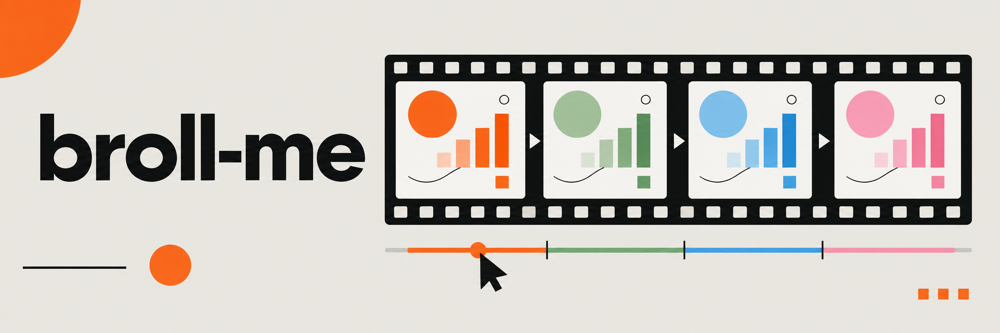
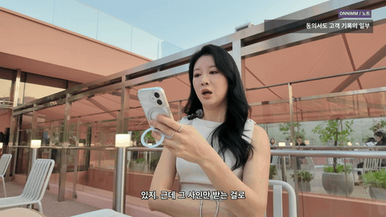

[English](README.md) · [한국어](README.ko.md)

# broll-me

## Input / Output 비교

| Input · 원본 영상 | Output · broll-me 적용 결과 |
| --- | --- |
| [](docs/assets/onnimm-context.html) | [](docs/assets/onnimm-context.html) |
| [입력 MP4 보기](docs/assets/onnimm-context-input.mp4) | [결과 MP4 보기](docs/assets/onnimm-context-output.mp4) |

두 칸 모두 같은 17.851초를 보여줍니다. 원본에는 카페에서 말하는 화자가 계속 나오고, 적용 결과에는 동의 이력 그래픽이 나온 뒤 다시 화자로 돌아옵니다.

**[비교 페이지](docs/assets/onnimm-context.html)를 로컬에서 열어 두 MP4를 맞춰 보세요.** HTML과 MP4를 같은 폴더에 두면 함께 재생됩니다. 소리는 Output에서만 나옵니다. GitHub의 GIF는 각각 재생되므로 시작이 조금 어긋날 수 있습니다. 적용 결과는 화자 5.005초 → B-roll 7.841초 → 화자 5.005초 순서입니다.

[B-roll 7장면 모두 보기 · 42.509초](docs/assets/onnimm-highlights.html). `onnimm-orange`를 사용한 설명용 그래픽이며 실제 제품 화면이나 고객 기록은 아닙니다.

<details>
<summary>예제 정보: 구간·프레임·오디오</summary>

원본의 1972~2506번 프레임(01:05.799~01:23.650)을 사용했습니다. 네 번째 인서트를 포함하며, 두 MP4는 모두 535프레임·1920×1080·`30000/1001` FPS입니다. 두 무음 GIF도 같은 구간을 480×270·10 FPS로 보여줍니다.

두 영상에는 원본에서 잘라 AAC로 인코딩한 같은 발화를 넣었습니다. 원본 영상과 제공된 preview는 변경하지 않았습니다. [프레임 범위와 hash](docs/assets/onnimm-context.json)를 확인하세요.

</details>

Skill 하나를 설치한 뒤 Codex나 Claude Code에 요청하세요. 제공한 문구로 모션 그래픽 B-roll을 만들고, 원하는 팔레트를 카드, terminal, chart, 투명 panel에 적용합니다.

## 1. npx로 설치하기

Skill을 사용할 프로젝트에서 terminal을 여세요. [Skills CLI](https://github.com/vercel-labs/skills#install-a-skill)로 `v0.8.0-beta.1` 릴리즈를 설치합니다.

```bash
npx skills add https://github.com/soom-kang/broll-me/tree/v0.8.0-beta.1 --skill broll-me --agent codex claude-code
```

이 명령은 베타 태그를 선택합니다. 검증 범위는 [릴리즈 노트와 다운로드](https://github.com/soom-kang/broll-me/releases/tag/v0.8.0-beta.1)에서 확인하세요. 로컬 checkout이나 릴리즈 ZIP을 푼 폴더로 설치하려면 절대 경로를 사용하세요.

```bash
# Replace this path with your checkout or extracted package folder.
npx skills add /path/to/broll-me --skill broll-me --agent codex claude-code
npx skills list --agent codex claude-code
```

설치 목록에는 **`broll-me` 하나**가 나옵니다. Codex는 `.agents/skills/broll-me`, Claude Code는 `.claude/skills/broll-me`를 읽습니다. 기본 설치 방식은 정본 하나를 두 host의 경로에서 참조하게 합니다. 다른 모션 skill을 추가로 설치할 필요는 없습니다. 로컬 설치는 `skills` CLI `1.7.0`으로 확인했습니다. [설치 검증 기록](reports/NPX_DOCUMENTATION.md)을 참고하세요.

`npx`가 없으면 먼저 Node.js와 npm을 준비하세요. 저장소를 가져오지 못하면 위의 로컬 명령을 사용하세요. Skill이 보이지 않으면 host의 목록을 새로 불러오거나 새 세션을 시작하세요. 기존 설치를 교체하기 전에는 [설치 및 복구 안내](skills/broll-me/reference/workflow.ko.md#1-skill-하나-설치하기)를 확인하세요.

## 2. 영상과 자막 준비하기

같은 영상의 파일을 프로젝트의 `inputs/` 폴더에 넣거나 agent에게 읽을 수 있는 경로를 알려 주세요. SRT와 VTT를 지원합니다. 노트는 선택 항목이며, 삽입 작업에는 시간이 표시된 자막이 필요합니다. Standalone clip은 파일이나 요청에 문구·chart 데이터를 제공하세요.

```text
inputs/source.mp4
inputs/source.srt
inputs/notes.json       # optional
```

Agent는 파일을 읽기 전에 작업 프로젝트의 절대 경로를 확정합니다. 입력 경로를 생략하면 `inputs/`에서 찾습니다. 영상·자막 조합이 여러 개이거나 필수 입력이 없으면 선택을 질문합니다. 파일 없는 standalone 요청도 문구나 데이터가 충분하면 진행합니다.

Plan, scene source, inspection, draft, log는 `works/<task>/`에, 최종 파일은 `outputs/<task>/`에 저장합니다. `palette-card`처럼 짧은 English 작업명을 정하고, 어느 한쪽 폴더에 같은 이름이 있으면 `-02` 같은 suffix를 붙입니다. 명시적인 이어하기 요청에는 지정한 작업을 재사용합니다. 사용자가 지정한 입력·결과 경로는 기본값보다 우선하며, 원본과 기존 결과를 보존합니다.

Skill 설치로 지침과 엔진 파일을 받습니다. 렌더링에는 아래 고정 버전의 로컬 runtime도 필요합니다. Agent는 렌더링 전에 runtime을 확인하고, 필요한 실행 파일이 있으면 프로젝트 내부에 setup할 수 있습니다. 실행 파일이나 browser 권한이 없으면 원인을 보고합니다.

지정한 runtime이 있으면 재사용합니다. 지정하지 않으면 `works/.runtime/broll-me/`를 선택하고 browser 검사 전에 `BROLL_RUNTIME`을 설정합니다. 선택한 runtime이 실패하면 오류를 보고하고 해당 단계를 중단합니다.

| 구성 요소 | 필수 버전 |
| --- | --- |
| Node.js | `24.21.0`, npm 포함 |
| Python | `3.12.14` |
| FFmpeg / FFprobe | `9.0.2`; `libx264`, `prores_ks` encoder |
| 로컬 module | Playwright `1.62.1`, NumPy `2.3.5` |
| Chromium | Revision `1234`, version `151.0.7922.34` |

## 3. 프롬프트 복사하기

**Codex**에서는 `$broll-me`를 호출하세요.

```text
$broll-me를 사용해 inputs/source.mp4와 같은 영상의 inputs/source.srt를 읽어 주세요.
inputs/notes.json이 있으면 함께 참고해 주세요. onnimm-orange 팔레트로
시술 기록, 동의 이력, 정보 접근 범위를 설명하는 짧은 B-roll cutaway를 만들어 주세요.
삽입 구간 사이에는 화자를 보여 주세요. 자막에서 문구와 삽입 구간을 제안한 뒤
draft를 보여 주세요. 원본을 보존하고 preview에는 원본 오디오를 복사해 주세요.
최종 clip, preview.mp4, viewer.html, compare.html, TIMING.md를
outputs/onnimm-cafe-broll에 저장해 이 로컬 작업 공간에서 확인할 수 있게 해 주세요.
```

**Claude Code**에서는 같은 요청을 `/broll-me`로 시작하세요.

```text
/broll-me
inputs/source.mp4와 같은 영상의 inputs/source.srt를 읽어 주세요.
inputs/notes.json이 있으면 함께 참고해 주세요. onnimm-orange 팔레트로
시술 기록, 동의 이력, 정보 접근 범위를 설명하는 짧은 B-roll cutaway를 만들어 주세요.
삽입 구간 사이에는 화자를 보여 주세요. 자막에서 문구와 삽입 구간을 제안한 뒤
draft를 보여 주세요. 원본을 보존하고 preview에는 원본 오디오를 복사해 주세요.
최종 clip, preview.mp4, viewer.html, compare.html, TIMING.md를
outputs/onnimm-cafe-broll에 저장해 이 로컬 작업 공간에서 확인할 수 있게 해 주세요.
```

내용과 파일 경로를 자신의 작업에 맞게 바꾸세요. 위 프롬프트는 orange 사례와 같은 작업 흐름을 따릅니다. 다른 팔레트를 써 보려면 [pink 카드 예제와 재현 프롬프트](docs/pink-demo.ko.md#샘플-재현하기)를 확인하세요.

Standalone은 이렇게 요청하세요. `$broll-me로 kkumil-pink 팔레트의 6초 한글 card를 만들어 주세요. 제목: 지난 시술 기록을 한눈에. 본문: 색소 배합, 시술 사진.` Claude Code에서는 호출만 `/broll-me`로 바꾸세요.

## 4. Draft 검토하기

제안된 팔레트, 문구, 삽입 시간을 확인하세요. HTML 검토 페이지를 열고 발화 timing, 한글 표시, 전환을 살펴보세요. Agent는 이미 승인한 결정을 그대로 사용합니다.

Draft는 frame당 한 번 캡처하며 motion blur를 생략합니다. Final은 4개 subframe에 motion blur를 적용합니다. 크기, FPS, frame 수는 같습니다. 영상 삽입에는 검사한 원본 규격을 사용합니다. Standalone 기본값은 1920×1080, 6초, 30 FPS입니다.

SRT/VTT에서 나눈 word timing은 추정치이므로 재생하며 확인하세요. 글자가 잘리면 문구를 줄이거나 장면을 나누세요. Browser나 encoder가 실패하면 agent가 보고한 명령과 오류를 [복구 안내](skills/broll-me/reference/troubleshooting.md)에서 확인하세요.

## 5. 결과물 받기

원본 영상 삽입 작업에서는 `outputs/<task>/`에 다음 파일을 받습니다.

| 출력 | 용도 |
| --- | --- |
| MP4 clip / alpha MOV panel | 편집기에 삽입합니다. 투명 panel은 영상 위 track에 놓습니다 |
| `preview.mp4` | 원본 위에 삽입한 결과를 재생합니다 |
| `viewer.html`, `compare.html` | 개별 clip을 보고 원본과 비교합니다 |
| `TIMING.md` | clip의 삽입 시간과 인용한 발화를 확인합니다 |
| Scene HTML, `palette.resolved.json` | 장면을 수정하고 확정된 색상을 확인합니다 |

Scene HTML은 팔레트 snapshot, shared `assets/broll-me-fonts/` 폴더, 필요한 local assets와 함께 전달합니다. Agent는 최종 참조가 `works/`에 의존하지 않는지 확인합니다. `compare.html`은 `inputs/`의 원본을 참조할 수 있습니다. 확인하지 못한 custom resource가 있으면 전달 완료로 보고하지 않습니다. HTML 하나로 전달하려면 `--font-mode embedded`를 선택하세요. Preview는 입력 오디오 stream을 복사합니다. 지원하지 않는 원본 timing이나 MP4와 호환되지 않는 오디오는 명확한 오류로 끝납니다. Skill은 복구 과정에서 원본 오디오를 임의로 정규화하거나 변환하지 않습니다.

Setup, 수동 CLI, 팔레트 변경, archive 설치는 [한국어 사용 가이드](skills/broll-me/reference/workflow.ko.md)나 [English workflow](skills/broll-me/reference/workflow.md)를 참고하세요.


1. Skill 하나를 설치합니다.
2. 입력을 지정하고 팔레트를 선택합니다.
3. Host에서 프롬프트를 실행합니다.
4. Draft를 검토하고 수정 사항을 승인합니다.
5. 최종 clip과 검토 파일을 받습니다.

## 팔레트 선택하기

Preset 하나를 고르거나 13개 색상 역할을 모두 담은 custom JSON을 제공하세요. `--palette`, `--palette-file` 중 하나만 사용합니다. [팔레트 템플릿](skills/broll-me/reference/palettes.md)을 참고하세요.

| Preset | Canvas | Accent |
| --- | --- | --- |
| `warm-orange` (기본값) | `#E9E7E2` | `#FF5A1F` |
| `sage-cream` | `#F4F1E8` | `#5E7D64` |
| `editorial-blue` | `#F3F6FA` | `#2F5BEA` |
| `midnight-cyan` | `#111827` | `#67E8F9` |
| `kkumil-pink` | `#FFF0E6` | `#FF5C8D` |
| `onnimm-orange` | `#FCFBF8` | `#FF8A50` |

팔레트는 생성한 그래픽에 적용합니다. 내용, 배치, 모션, timing은 유지합니다. 원본 색 보정, 실사 생성, 최종 master 편집은 이 skill의 범위에 포함하지 않습니다.

## 유지보수 검사

Checkout에서 `make check`, `python3 scripts/package.py`를 실행하면 `dist/`에 로컬 배포물을 생성합니다. 릴리즈된 [Skill archive](https://github.com/soom-kang/broll-me/releases/download/v0.8.0-beta.1/broll-me.skill), [ZIP](https://github.com/soom-kang/broll-me/releases/download/v0.8.0-beta.1/broll-me.zip), [hash manifest](https://github.com/soom-kang/broll-me/releases/download/v0.8.0-beta.1/package-manifest.json)는 GitHub Release assets에서 내려받으세요. 샘플 영상, runtime, 평가 기록, 비공개 artwork는 archive에 넣지 않습니다.

이전에 수행한 로컬 설치와 샘플 렌더링은 [검증 기록](reports/NPX_DOCUMENTATION.md)에서 확인하세요. 문서 상단의 사례는 제공된 broll-me 제작 preview에서 추출했습니다. 기존 host 평가는 별도로 유지합니다. Claude Code는 fixture 요청 2건을 완료했고, Codex는 Chromium 권한 오류로 중단되어 품질 점수를 받지 않았습니다. [Host 실행 근거](reports/ENGINE_IMPROVEMENTS.md)를 참고하세요. 사용자 재생 승인은 별도로 확인해야 합니다.

재배포할 때는 [MIT license](skills/broll-me/LICENSE)와 [font 및 icon 고지](skills/broll-me/THIRD_PARTY_NOTICES.md)를 유지하세요. Workflow는 [HyperFrames의 motion-graphics skill](https://github.com/heygen-com/hyperframes/blob/main/skills/motion-graphics/SKILL.md)에서 영감을 받았습니다. Workflow 참고이며 엔진 코드 출처를 뜻하지 않습니다.
