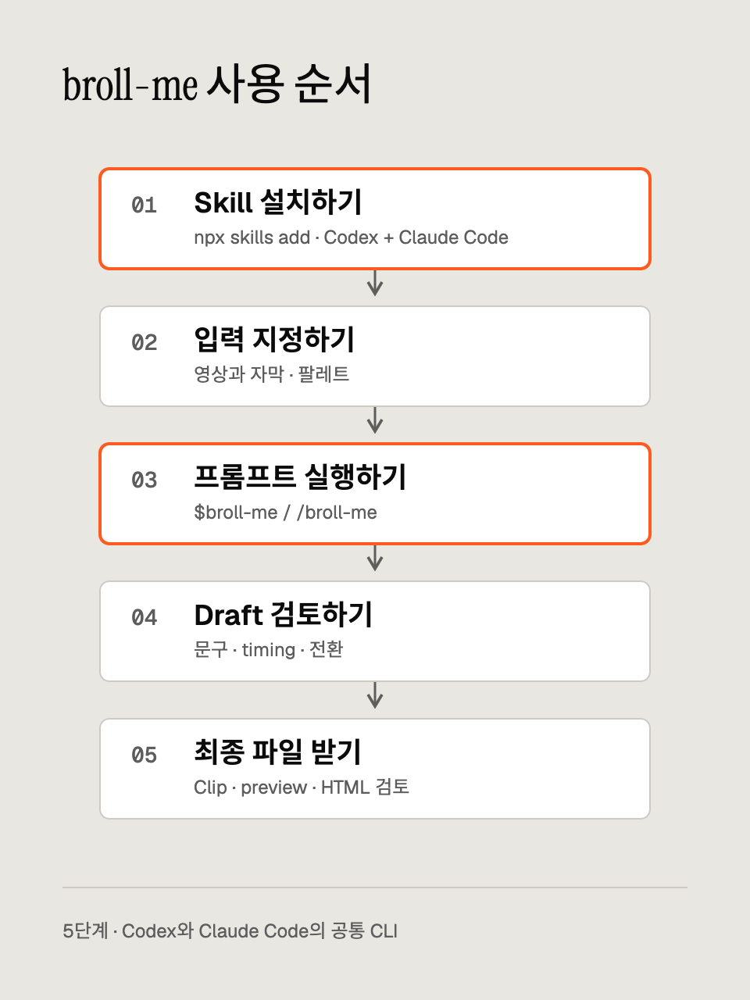

# 설치하고 프롬프트로 B-roll 만들기

작업할 프로젝트에 skill을 설치하세요. Standalone clip과 원본 영상 삽입 모두 아래 5단계로 진행합니다.

[English](workflow.md) · [한국어](workflow.ko.md)



[다이어그램 HTML](assets/workflow-ko.html)을 수정할 수 있습니다.

1. Skill 하나를 설치합니다.
2. 입력을 지정하고 팔레트를 선택합니다.
3. Codex나 Claude Code에서 프롬프트를 실행합니다.
4. Draft를 검토합니다.
5. 최종 파일을 받습니다.

## 1. Skill 하나 설치하기

작업할 프로젝트에서 `v0.8.0-beta.2` 릴리즈를 설치하세요.

```bash
npx skills add https://github.com/soom-kang/broll-me/tree/v0.8.0-beta.2 --skill broll-me --agent codex claude-code
npx skills list --agent codex claude-code
```

이 명령은 베타 태그를 선택합니다. 배포물과 검증 범위는 [릴리즈 노트와 다운로드](https://github.com/soom-kang/broll-me/releases/tag/v0.8.0-beta.2)에서 확인하세요. 로컬 checkout이나 릴리즈 ZIP을 푼 폴더로 설치하려면 절대 경로를 사용하세요.

```bash
npx skills add /path/to/broll-me --skill broll-me --agent codex claude-code
```

압축을 푼 패키지는 `SKILL.md`를 직접 포함하고, checkout은 `skills/broll-me/` 아래에 포함합니다. 목록에는 `broll-me` 하나가 나옵니다. 기본 설치 방식은 `.agents/skills/broll-me`에 정본을 두고 `.claude/skills/broll-me`에서 참조하게 합니다. `--copy`는 host마다 사본을 만듭니다. 로컬 경로는 `skills` CLI `1.7.0`으로 확인했습니다.

이 개발 checkout에 발견 경로가 이미 연결되어 있다면 별도 프로젝트에 설치하세요. 기존 설치를 교체하기 전에는 경로를 확인하세요. `skills`로 설치한 항목을 제거할 때는 이 skill만 지정하세요.

```bash
npx skills remove broll-me --agent codex claude-code
```

`$broll-me`나 `/broll-me`가 보이지 않으면 host의 skill 목록을 새로 불러오거나 새 세션을 시작하세요. 소스를 가져오지 못했다면 설치도 완료되지 않은 것입니다. 존재하는 로컬 폴더로 다시 실행하세요. `npx`에는 Node.js와 npm이 필요합니다. Skill 설치는 렌더링 runtime을 준비하지 않습니다.

## 2. 입력과 팔레트 지정하기

**Standalone**은 목적, 정확한 문구나 chart 수치, 팔레트를 제공하세요. 크기와 길이는 선택 항목입니다. 기본값은 1920×1080, 6초, 30 FPS입니다.

**원본 영상 삽입**은 읽을 수 있는 영상과 같은 영상의 SRT/VTT를 제공하세요. 노트, 안전 영역, 삽입 구간은 선택 항목입니다. Agent는 영상 규격과 자막을 확인하고 삽입 계획을 제시합니다. Speaker box는 추정값이므로 panel을 배치하기 전에 contact sheet를 직접 확인해야 합니다. 자막 cue에서 나눈 word timing도 추정치입니다.

```text
inputs/source.mp4
inputs/source.srt
inputs/notes.json       # optional
```

파일을 읽기 전에 작업 프로젝트의 절대 경로를 확정하세요. 설치된 skill 폴더와 구분합니다. 입력 경로를 생략하면 `inputs/`에서 찾고, 영상·자막 조합이 여러 개이거나 필수 입력이 없으면 선택을 질문합니다. 파일 없는 standalone 요청도 문구나 데이터가 충분하면 진행합니다.

`palette-card`처럼 짧은 English 작업명을 정해 `works/<task>/`, `outputs/<task>/`에 사용합니다. 어느 한쪽에 같은 이름이 있으면 `palette-card-02`, 다음에는 `-03`을 선택합니다. 명시적인 이어하기 요청에만 기존 작업을 재사용합니다. 사용자가 지정한 입력·결과 경로는 기본값보다 우선하며, 원본과 이전 결과를 보존합니다.

```text
<project>/
├── inputs/                     supplied files
├── works/
│   ├── .runtime/broll-me/       shared rendering runtime
│   └── palette-card/           scene sources, plan, inspection, drafts, logs
└── outputs/
    └── palette-card/           final media and review files
```

`warm-orange`가 기본 팔레트입니다. `sage-cream`, `editorial-blue`, `midnight-cyan`, `kkumil-pink`, `onnimm-orange`도 선택할 수 있습니다. 지정한 브랜드나 팔레트가 있으면 기본값보다 우선합니다. Custom JSON은 13개 역할을 모두 `#RRGGBB`로 지정해야 합니다. [팔레트 안내](palettes.md)를 확인하세요. 잘못된 색상이나 대비는 HTML 출력 전에 실패합니다.

렌더링 전에 아래 실행 파일을 준비하세요. Setup은 시스템 도구를 설치하지 않습니다. 기본 실행 파일의 버전이 다르면 맞는 경로를 지정하세요.

| 구성 요소 | 필수 버전 |
| --- | --- |
| Node.js | `24.21.0`, npm 포함 |
| Python | `3.12.14` |
| FFmpeg / FFprobe | `9.0.2`, `libx264`, `prores_ks` 포함 |
| 로컬 module | Playwright `1.62.1`, NumPy `2.3.5` |
| Chromium | Revision `1234`, version `151.0.7922.34` |

Agent는 설치된 `SKILL.md`를 찾고, 지정한 runtime이나 기본 `works/.runtime/broll-me/`를 선택합니다. `doctor` 등 browser 검사 전에 `BROLL_RUNTIME`을 설정하고 준비된 runtime을 재사용합니다. 로컬 렌더링이 승인된 작업이고 실행 파일의 버전이 맞으면 해당 경로에 `setup.sh`를 실행할 수 있습니다. 실행 파일 누락, 버전 불일치, browser 권한 오류가 나면 해당 단계를 중단하고 실제 오류와 다음 행동을 보고합니다. [Runtime 복구](troubleshooting.md#runtime-and-browser)를 참고하세요. 지속적인 중간 파일은 `works/<task>/`에 저장하며, engine의 atomic 저장용 temp와 OS temp는 기존 동작을 유지합니다.

## 3. 프롬프트 실행하기

Codex에서는 `$broll-me`, Claude Code에서는 `/broll-me`로 시작한 뒤 같은 요청을 붙이세요. 프로젝트 밖의 파일은 읽을 수 있는 절대 경로를 사용하세요.

```text
inputs/source.mp4와 같은 영상의 inputs/source.srt를 읽어 주세요.
inputs/notes.json이 있으면 함께 참고해 주세요. kkumil-pink 팔레트로
색소 배합과 시술 사진을 설명하는 짧은 card cutaway를 만들어 주세요.
도입부의 화자는 그대로 보여 주세요. 자막을 보고 삽입 시간을 제안한 뒤
draft를 보여 주세요. 원본을 보존하고 preview에는 원본 오디오를 복사해 주세요.
최종 clip, preview.mp4, viewer.html, compare.html, TIMING.md를
outputs/palette-card에 저장해 로컬에서 확인할 수 있게 해 주세요.
```

Standalone은 다음처럼 요청하세요.

```text
kkumil-pink 팔레트로 6초 한글 card를 만들어 주세요.
제목: 지난 시술 기록을 한눈에
본문: 색소 배합, 시술 사진
draft를 보여 준 뒤 최종 MP4와 팔레트 snapshot을 전달해 주세요.
```

Agent는 공통 CLI와 [장면 템플릿](scenes.md)을 사용합니다. Card와 panel에는 `title`, `body`가 필요합니다. Terminal은 `title`, `lines`, chart는 `title`과 제공된 비음수 `bars` 값을 사용합니다. Custom HTML이 필요할 때만 [엔진 API](engine-api.md)를 읽습니다. 수치, 고객 기록, 인용한 발화를 임의로 만들지 않습니다.

승인된 문구, 팔레트, 삽입 구간은 재사용하세요. 새로 정할 사항에 승인이 필요한 작업이면 먼저 확인합니다. 자막이나 노트, 이전 렌더링 결과만으로 승인되었다고 판단하지 않습니다.

## 4. Draft 검토하기

Draft와 주요 frame을 여세요. 한글 가독성, 대비, cutaway timing, 전환을 확인하세요. 투명 panel은 구간 전체에서 화자를 가리지 않아야 합니다. 바꿀 시간이나 문구를 agent에게 알려 주세요.

Draft는 frame당 한 번 캡처하며 motion blur를 생략합니다. Final은 4개 subframe에 motion blur를 적용합니다. 크기, FPS, frame 수, container, alpha 동작은 같습니다. Draft는 검토용이므로 전달할 결과에는 final 렌더링을 요청하세요.

`check`는 scene 계약, 표본 시점의 browser 오류, resource 요청 실패, template text overflow를 검사합니다. 재생 확인도 필요합니다. 글자가 잘리면 문구를 줄이거나 장면을 나눈 뒤 다시 build하세요. Browser나 encoder 오류는 CLI JSON과 stderr에서 확인하고 원인을 고친 뒤 해당 단계만 재실행하세요. 이전 결과는 보존합니다.

## 5. 최종 파일 받기

최종 파일은 `outputs/<task>/`에 저장합니다. Author/build만 요청하면 spec, HTML bundle, 결과 경로를 전달하고 browser 검사와 재생 확인은 실행하지 않았다고 보고합니다. 렌더링과 preview 합성은 요청 범위에 포함된 경우 진행합니다. Standalone media delivery는 최종 MP4나 alpha MOV, scene HTML, 팔레트 snapshot, 주요 frame을 받습니다. 영상이 없으면 원본 검사나 오디오 보존을 완료했다고 보고하지 않습니다.

원본 영상 작업은 `preview.mp4`, `viewer.html`, `compare.html`, `TIMING.md`도 받습니다. 전체 화면 card는 MP4와 `kind:full`을 사용합니다. Panel은 `bg:null`을 유지하며 ProRes 4444 MOV와 `kind:panel`을 사용합니다. 검토 페이지가 참조하는 clip과 입력 파일의 경로를 유지하세요. Preview로 삽입을 검토하고, 최종 master는 편집자가 승인합니다.

Final 렌더링 전에 scene bundle 전체를 `outputs/<task>/scenes/<scene>/`에 복사하세요. HTML, `palette.resolved.json`, shared `assets/broll-me-fonts/`, 필요한 local assets를 포함합니다. 전달 위치에서 참조를 확인하세요. 최종 scene과 검토 파일이 `works/`에 의존하면 안 됩니다. `compare.html`은 `inputs/`의 원본을 참조할 수 있습니다. 확인하지 못한 custom resource가 있으면 전달 완료로 보고하지 않습니다. Build나 preview에서 `--font-mode embedded`를 선택하면 개별 HTML을 파일 하나로 전달할 수 있습니다. 두 방식 모두 font 고지를 유지합니다.

Preview는 원본 파일을 보존하고 audio stream을 복사합니다. Video와 audio가 0에서 시작해야 하며, audio는 video 길이 안에 들어오고 MP4와 호환되어야 합니다. 지원하지 않는 timing이나 codec은 실패합니다. 승인된 호환 입력 사본을 제공하거나 별도 오디오 편집을 진행하세요. Skill은 복구를 위해 원본 오디오를 임의로 정규화하거나 자르거나 변환하지 않습니다. 삽입 구간이 clip보다 길면 마지막 frame을 끝까지 유지합니다.

전달 파일, 팔레트, 실제 검사, 중단된 작업, 남은 재생 승인을 보고하세요. 기존 host 평가에는 Claude Code fixture 성공과 Codex Chromium 권한 차단이 기록되어 있습니다. 로컬 CLI 성공으로 해당 provider 결과를 바꾸지 않습니다.

## 고급: runtime 직접 준비하기

실제 설치 폴더를 찾으세요. 아래 경로는 `npx skills`의 기본 프로젝트 설치에 맞습니다. 소스 checkout에서는 Python 설치기로 두 host를 `skills/broll-me`에 연결할 수도 있습니다. 개발용 보조 경로입니다.

```bash
export BROLL_SKILL_DIR="$PWD/.agents/skills/broll-me"
export BROLL_RUNTIME="${BROLL_RUNTIME:-$PWD/works/.runtime/broll-me}"
```

작업 프로젝트에서 명령을 실행하세요. 지정한 준비된 runtime이 있으면 그 절대 경로를 설정합니다. 직접 CLI 실행의 runtime 선택 순서는 `--runtime PATH`, `BROLL_RUNTIME`, `./motion`으로 유지합니다. Skill은 검사 전에 선택한 runtime을 설정합니다. 필요하면 `BROLL_NODE`, `BROLL_PYTHON`, `BROLL_FFMPEG`, `BROLL_FFPROBE`, `BROLL_NPM`에 고정 버전의 실행 파일 경로를 지정하세요. Setup 전에 버전과 encoder를 확인하세요.

```bash
"${BROLL_NODE:-node}" --version
"${BROLL_PYTHON:-python3}" --version
"${BROLL_FFMPEG:-ffmpeg}" -version
"${BROLL_FFPROBE:-ffprobe}" -version
"${BROLL_FFMPEG:-ffmpeg}" -hide_banner -encoders
```

고정 버전과 필수 encoder 2개를 확인하세요. 다르면 맞는 경로를 선택한 뒤 진행합니다. Setup은 로컬 Python virtualenv, NumPy, Node module, Chromium을 설치하며 시스템 실행 파일은 설치하지 않습니다.

```bash
bash "$BROLL_SKILL_DIR/scripts/setup.sh" "$BROLL_RUNTIME"
python3 "$BROLL_SKILL_DIR/scripts/broll.py" doctor
```

`status:completed`, `ready:true`가 나오면 준비된 상태입니다. Doctor는 browser를 실제 실행하고 override를 포함한 버전을 검사합니다. 준비된 runtime이 있으면 `BROLL_RUNTIME`을 지정하고 setup을 생략하세요. 이 개발 checkout의 `.runtime/motion`은 배포물에 포함하지 않습니다.

## 고급: standalone 직접 렌더링하기

작은 장면 하나를 작성한 뒤 build, check, draft render를 실행하세요. 예시는 `works/`, `outputs/` 양쪽에 `palette-card`가 없는 경우입니다. 이미 있으면 suffix를 붙인 작업명으로 바꾸세요.

```bash
mkdir -p works/palette-card
cat > works/palette-card/scene.json <<'JSON'
{
  "schema_version": 1,
  "template": "card",
  "title": "Choose a palette",
  "body": "Keep the motion. Change the colors.",
  "width": 640,
  "height": 360,
  "duration": 1
}
JSON
python3 "$BROLL_SKILL_DIR/scripts/broll.py" build works/palette-card/built \
  --scene works/palette-card/scene.json --palette kkumil-pink
python3 "$BROLL_SKILL_DIR/scripts/broll.py" check works/palette-card/built/scene.html
python3 "$BROLL_SKILL_DIR/scripts/broll.py" render \
  works/palette-card/built/scene.html works/palette-card/scene-draft.mp4 --quality draft
```

Draft 승인 뒤 bundle을 전달 위치에 복사하고 그 위치에서 final을 렌더링하세요.

```bash
mkdir -p outputs/palette-card/scenes/scene
cp -R works/palette-card/built/. outputs/palette-card/scenes/scene/
python3 "$BROLL_SKILL_DIR/scripts/broll.py" check outputs/palette-card/scenes/scene/scene.html
python3 "$BROLL_SKILL_DIR/scripts/broll.py" render \
  outputs/palette-card/scenes/scene/scene.html outputs/palette-card/scene.mp4 --quality final
```

Draft는 `works/palette-card/`에, 최종 MP4와 scene bundle은 `outputs/palette-card/`에 둡니다. Final 검사 전에 custom local assets도 참조 경로를 유지하며 복사하세요. 입력이 잘못되면 표시된 field를 고치세요. 다른 팔레트는 새 build 폴더를 사용하세요. 필요하면 `--fps 30000/1001`을 추가합니다. 기본 렌더링은 30 FPS입니다. Alpha는 panel scene과 `.mov`를 사용하세요. Beats, inspect 등은 [CLI 사용법](usage.md)을 참고하세요.

## 고급: 삽입 preview 직접 만들기

장면 작성 전에 원본과 자막을 확인하세요.

```bash
python3 "$BROLL_SKILL_DIR/scripts/broll.py" inspect inputs/source.mp4 works/palette-card/inspection
python3 "$BROLL_SKILL_DIR/scripts/broll.py" words inputs/source.srt
```

`video.json`, `contact.png`, 추정 word time이 출력됩니다. 검사한 width, height, FPS로 승인된 장면을 build, check, render하세요. Plan은 `works/palette-card/plan.json`에 저장합니다. 상대 경로는 명령을 실행한 위치가 아닌 해당 plan 파일을 기준으로 해석합니다.

```json
{
  "video": "../../inputs/source.mp4",
  "fps": "30000/1001",
  "clips": [{
    "id": "01",
    "title": "Approved card",
    "line": "Exact supplied subtitle text",
    "file": "../../outputs/palette-card/scene.mp4",
    "kind": "full",
    "in": 1,
    "out": 3
  }],
  "notes": ["Illustrative graphic; not a product screen."]
}
```

예시에는 3초 이상의 영상이 필요합니다. 검사한 원본과 승인된 plan에 맞게 시간과 FPS를 바꾼 뒤 실행하세요.

```bash
python3 "$BROLL_SKILL_DIR/scripts/broll.py" preview \
  works/palette-card/plan.json outputs/palette-card/preview.mp4
```

CLI는 preview, HTML 검토 페이지, timing 문서, shared font를 임시 폴더에서 완성한 뒤 파일별로 전달합니다. 파일 누락, clip 겹침, 범위를 벗어난 시간은 실패합니다. Plan을 고친 뒤 다시 실행하세요. 파일 전달에 실패하면 이전 파일의 복구 여부를 확인하세요. 오류에 recovery 파일 보존 경로가 표시되면 해당 폴더를 보존하고 복구를 마칠 때까지 재실행을 중단하세요. 파일 전달, 오디오, encoder 오류는 [Media 복구](troubleshooting.md#media-and-delivery)를 참고하세요.

## 고급: archive와 개발용 설치

`broll-me.zip`이나 ZIP 형식의 `.skill`을 푸세요. `broll-me/SKILL.md`가 있는 상위 폴더 또는 해당 `broll-me` 폴더를 `npx skills add`에 지정하세요. Runtime과 영상은 포함하지 않습니다.

Checkout의 Python 설치기는 개발용 보조 경로입니다. Checkout root에서 실행하세요.

```bash
python3 scripts/install_skill.py --project /path/to/project --host both --dry-run
python3 scripts/install_skill.py --project /path/to/project --host both
```

정본 하나를 참조하는 상대 링크 2개를 만듭니다. 같은 링크가 있으면 `already installed`를 출력하고, 다른 경로와 충돌하면 교체 없이 exit code `1`로 끝납니다. Python 설치기로 만든 링크는 출력된 `unlink` 명령으로만 제거하세요. 이 방법으로 `npx`의 정본 디렉터리를 제거하지 마세요.
