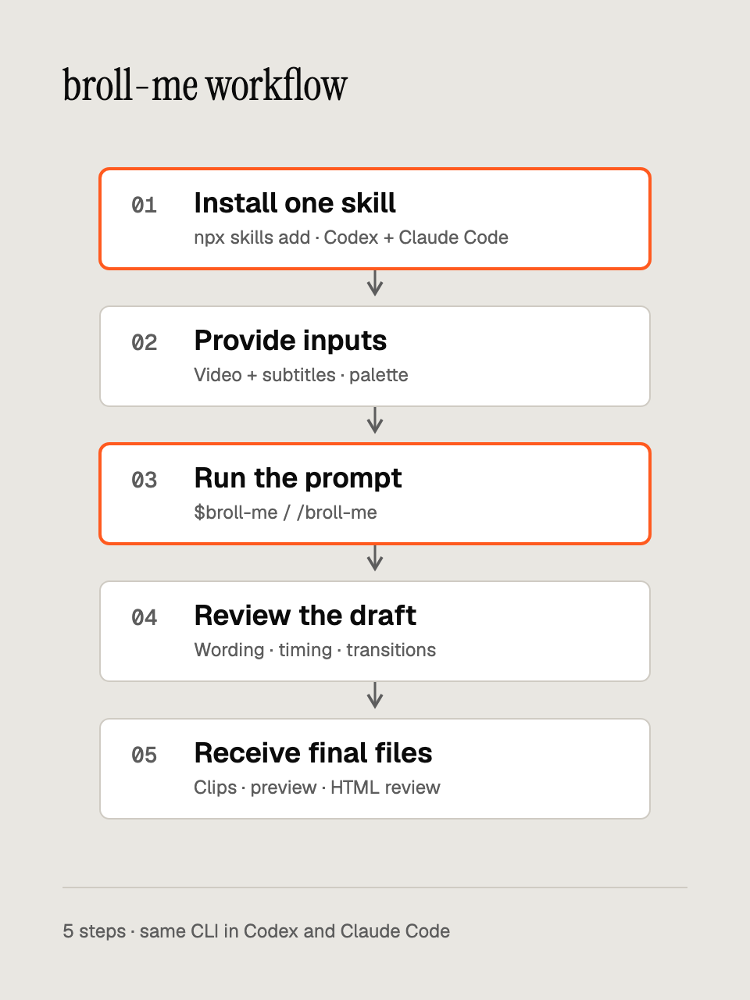

# Install, prompt and review B-roll

Install the skill in the project where you will work. Use the five steps below for a standalone clip or an insert into existing footage.

[English](workflow.md) · [한국어](workflow.ko.md)



Edit the [diagram HTML](assets/workflow-en.html).

1. Install one skill.
2. Provide inputs and select a palette.
3. Run the prompt in Codex or Claude Code.
4. Review the draft.
5. Receive final files.

## 1. Install one skill

After the planned GitHub repository is published, run from your working project:

```bash
npx skills add soom-kang/broll-me --skill broll-me --agent codex claude-code
npx skills list --agent codex claude-code
```

The GitHub source is planned, not publication-verified. Before publication, replace it with the absolute path to a local checkout or an extracted ZIP:

```bash
npx skills add /path/to/broll-me --skill broll-me --agent codex claude-code
```

The source folder must contain `SKILL.md` directly, as an extracted package does, or under `skills/broll-me/`, as a checkout does. Expect one `broll-me` entry. The default installation puts its canonical files in `.agents/skills/broll-me` and links `.claude/skills/broll-me` to them. `--copy` creates host-specific copies instead. The local route was verified with `skills` CLI `1.7.0`.

Use a separate working project when this development checkout already has discovery links. Inspect an existing installation before replacing it. To remove an installation managed by `skills`, target only this skill:

```bash
npx skills remove broll-me --agent codex claude-code
```

Reload the host's skill list or start a new session if `$broll-me` or `/broll-me` is missing. A source-fetch failure does not mean the skill installed; retry with an existing local folder. `npx` requires Node.js and npm. Skill installation does not provision the rendering runtime.

## 2. Provide inputs and choose a palette

For **standalone work**, provide a purpose, exact wording or chart values, a palette and an optional size or duration. Defaults are 1920×1080, six seconds and 30 FPS.

For **source-video inserts**, provide readable footage and its matching SRT/VTT. Notes, safe areas and insertion slots are optional. The agent inspects dimensions and FPS, reads the transcript and presents an insertion plan. Speaker boxes are heuristics; the agent must inspect the contact sheet before placing a panel. Word timing derived from cues is estimated.

```text
inputs/source.mp4
inputs/source.srt
inputs/notes.json       # optional
```

Resolve the working project's absolute path before reading inputs. Keep that project separate from the installed skill folder. Without explicit paths, search `inputs/`; ask for a selection when several video/subtitle pairs match or required inputs are missing. A standalone request can use wording or data supplied in the prompt without files.

Use a short English task name, such as `palette-card`, for both `works/<task>/` and `outputs/<task>/`. If either name exists, choose `palette-card-02`, then `-03`; reuse a task only for an explicit continuation. User-specified input and output paths take precedence. Preserve source files and previous results.

```text
<project>/
├── inputs/                     supplied files
├── works/
│   ├── .runtime/broll-me/       shared rendering runtime
│   └── palette-card/           scene sources, plan, inspection, drafts, logs
└── outputs/
    └── palette-card/           final media and review files
```

Choose `warm-orange` (default), `sage-cream`, `editorial-blue`, `midnight-cyan`, `kkumil-pink` or `onnimm-orange`. A selected brand or palette takes precedence over the default. Custom JSON requires all 13 roles as `#RRGGBB`; see [palettes](palettes.md). Invalid colors or contrast fail before HTML output.

Prepare these binaries before rendering. System-tool installation is outside the skill's setup script; provide matching executable paths when your defaults differ.

| Component | Required version |
| --- | --- |
| Node.js | `24.21.0`, with npm |
| Python | `3.12.14` |
| FFmpeg / FFprobe | `9.0.2`, with `libx264` and `prores_ks` |
| Local modules | Playwright `1.62.1`, NumPy `2.3.5` |
| Chromium | Revision `1234`, version `151.0.7922.34` |

The agent locates the installed `SKILL.md` and selects the specified runtime, or `works/.runtime/broll-me/` when none is specified. It sets `BROLL_RUNTIME` before `doctor` or other browser checks and reuses a ready runtime. If local rendering is authorized and binaries match, it can run `setup.sh` there. Missing binaries, version mismatches or browser permissions stop the affected step with the exact error and next action; see [runtime recovery](troubleshooting.md#runtime-and-browser). Persistent task intermediates stay in `works/<task>/`; the engine's atomic temporary files and OS temporary files keep their existing behavior.

## 3. Run a prompt

In Codex, start with `$broll-me`. In Claude Code, start with `/broll-me`. Append the same request. Use readable absolute paths when files live outside the project.

```text
Use inputs/source.mp4 and its matching inputs/source.srt.
Read inputs/notes.json if it exists. Use kkumil-pink for a short card
cutaway about pigment mixtures and treatment photos. Keep the opening
speaker footage visible. Propose insertion times from the transcript,
then show a draft. Preserve the source and copy its audio into the preview.
Save final clips, preview.mp4, viewer.html, compare.html and TIMING.md
under outputs/palette-card for local review.
```

For standalone work, use:

```text
Make a 6-second Korean card with kkumil-pink.
Title: 지난 시술 기록을 한눈에
Body: 색소 배합, 시술 사진
Show a draft, then deliver the final MP4 and palette snapshot.
```

The agent uses the common CLI and [scene templates](scenes.md). Card and panel require `title` and `body`; terminal requires `title` and `lines`; chart requires `title` and supplied nonnegative `bars` values. It reads the [engine API](engine-api.md) only when custom HTML is needed. It does not invent data, customer records or quotations.

Reuse approved wording, palette and slots. Confirm new creative decisions when the task requires it. A transcript, notes file or previous render does not itself establish approval.

## 4. Review the draft

Open the draft and key frames. Check readable Korean text, contrast, cutaway timing and transitions. For a transparent panel, check the speaker's movement across the whole slot. Tell the agent which time or wording to change.

Draft captures one image per frame without motion blur. Final captures four subframes with motion blur. Dimensions, FPS, frame count, container and alpha behavior stay the same. A draft is review media; request final rendering for delivery.

`check` validates scene contracts, sampled browser errors and template text overflow. Playback still matters. On clipped text, shorten it or split the scene before rebuilding. On a browser or encoder error, inspect the CLI JSON and stderr, fix the cause and retry only the affected step. Keep previous outputs.

## 5. Receive final files

Final files go in `outputs/<task>/`. For an author/build-only request, deliver the spec, HTML bundle and artifact paths; report browser checks and playback as not run. Render clips and compose a preview when the request includes those steps. For standalone media delivery, receive the final MP4 or alpha MOV, scene HTML, palette snapshot and key frames. Source inspection and audio preservation claims do not apply without footage.

For source-video work, also receive `preview.mp4`, `viewer.html`, `compare.html` and `TIMING.md`. Full-frame cards use MP4 and `kind:full`; panels keep `bg:null`, use ProRes 4444 MOV and `kind:panel`. Review pages need their referenced clip and input files to remain available. The preview supports insertion review; an editor approves the final master.

Before final rendering, copy the complete scene bundle to `outputs/<task>/scenes/<scene>/`, including HTML, `palette.resolved.json`, shared `assets/broll-me-fonts/` and required local assets. Check references from the delivered location. Final scene and review files must not depend on `works/`; `compare.html` may reference the source in `inputs/`. Report unresolved custom resources before claiming delivery complete. Select `--font-mode embedded` at build or preview time to make an individual HTML file self-contained. Both modes retain font notices.

The preview preserves source files and copies their audio streams. Video and audio must start at zero; audio must fit inside the video duration and be MP4-compatible. Unsupported timing or codecs cause failure. Supply an approved compatible input copy or arrange separate audio editing. The skill does not normalize, truncate or transcode original audio as an automatic fallback. If the slot is longer than its clip, the preview holds the last frame until the slot ends.

Report delivered files, palette, actual checks, blocked work and remaining playback approval. Earlier host evidence records Claude Code fixture success and Codex Chromium permission blocks; local CLI success does not change those provider results.

## Advanced: prepare the runtime manually

Find the actual installed folder. The path below matches default project-local `npx skills` installation. From a source checkout, the manual Python installer can instead link both hosts to `skills/broll-me`; that remains a development option.

```bash
export BROLL_SKILL_DIR="$PWD/.agents/skills/broll-me"
export BROLL_RUNTIME="${BROLL_RUNTIME:-$PWD/works/.runtime/broll-me}"
```

Run these commands from the working project. Reuse a specified ready runtime by setting its absolute path instead. Direct CLI runtime selection remains `--runtime PATH`, then `BROLL_RUNTIME`, then `./motion`; the skill sets its selected runtime before checks. Set `BROLL_NODE`, `BROLL_PYTHON`, `BROLL_FFMPEG`, `BROLL_FFPROBE` or `BROLL_NPM` to matching executable paths when needed. Inspect versions and encoders before setup:

```bash
"${BROLL_NODE:-node}" --version
"${BROLL_PYTHON:-python3}" --version
"${BROLL_FFMPEG:-ffmpeg}" -version
"${BROLL_FFPROBE:-ffprobe}" -version
"${BROLL_FFMPEG:-ffmpeg}" -hide_banner -encoders
```

Expect the pinned versions and both required encoders. If they differ, choose matching paths before continuing. Setup installs a local Python virtualenv, NumPy, Node modules and Chromium, not system binaries:

```bash
bash "$BROLL_SKILL_DIR/scripts/setup.sh" "$BROLL_RUNTIME"
python3 "$BROLL_SKILL_DIR/scripts/broll.py" doctor
```

Expect `status:completed` and `ready:true`. Doctor performs a real browser launch and checks its version, including overrides. Reuse a ready runtime by setting `BROLL_RUNTIME` and skipping setup. This development checkout keeps its runtime in `.runtime/motion`; it is not distributed.

## Advanced: render a standalone clip manually

Create one small scene, then build, check and render a draft. The following example assumes `palette-card` is unused in both `works/` and `outputs/`; choose a suffixed name if it exists.

```bash
mkdir -p works/palette-card
cat > works/palette-card/scene.json <<'JSON'
{
  "schema_version": 1,
  "template": "card",
  "title": "Choose a palette",
  "body": "Keep the motion. Change the colors.",
  "width": 640,
  "height": 360,
  "duration": 1
}
JSON
python3 "$BROLL_SKILL_DIR/scripts/broll.py" build works/palette-card/built \
  --scene works/palette-card/scene.json --palette kkumil-pink
python3 "$BROLL_SKILL_DIR/scripts/broll.py" check works/palette-card/built/scene.html
python3 "$BROLL_SKILL_DIR/scripts/broll.py" render \
  works/palette-card/built/scene.html works/palette-card/scene-draft.mp4 --quality draft
```

After draft approval, deliver the bundle and render from its final location:

```bash
mkdir -p outputs/palette-card/scenes/scene
cp -R works/palette-card/built/. outputs/palette-card/scenes/scene/
python3 "$BROLL_SKILL_DIR/scripts/broll.py" check outputs/palette-card/scenes/scene/scene.html
python3 "$BROLL_SKILL_DIR/scripts/broll.py" render \
  outputs/palette-card/scenes/scene/scene.html outputs/palette-card/scene.mp4 --quality final
```

The draft stays in `works/palette-card/`. The final MP4 and scene bundle stay in `outputs/palette-card/`. Copy any custom local assets while preserving their paths before the final check. If a field is invalid, correct the named field. Use a new build folder for another palette. Add `--fps 30000/1001` when required; the render default is 30 FPS. Use a panel scene and `.mov` for alpha. See [CLI usage](usage.md) for beats, inspection and other commands.

## Advanced: compose inserts manually

Inspect the video and read its transcript before authoring a scene:

```bash
python3 "$BROLL_SKILL_DIR/scripts/broll.py" inspect inputs/source.mp4 works/palette-card/inspection
python3 "$BROLL_SKILL_DIR/scripts/broll.py" words inputs/source.srt
```

Expect `video.json`, `contact.png` and estimated word times. Use the inspected width, height and FPS, then build/check/render each approved scene. Save the plan as `works/palette-card/plan.json`; relative paths resolve from that file, not the command's current directory:

```json
{
  "video": "../../inputs/source.mp4",
  "fps": "30000/1001",
  "clips": [{
    "id": "01",
    "title": "Approved card",
    "line": "Exact supplied subtitle text",
    "file": "../../outputs/palette-card/scene.mp4",
    "kind": "full",
    "in": 1,
    "out": 3
  }],
  "notes": ["Illustrative graphic; not a product screen."]
}
```

The example requires footage at least three seconds long. Replace its times and FPS with the inspected source and approved plan, then run:

```bash
python3 "$BROLL_SKILL_DIR/scripts/broll.py" preview \
  works/palette-card/plan.json outputs/palette-card/preview.mp4
```

Expect the preview, HTML review pages, timing file and shared fonts. Missing files, overlapping clips or out-of-range timing fail; correct the plan and retry. Read [media recovery](troubleshooting.md#media-and-delivery) for audio or encoder failures.

## Advanced: archive and development installation

Extract `broll-me.zip` or the ZIP-format `.skill` archive. Point `npx skills add` at the extracted folder that contains `broll-me/SKILL.md`, or directly at that `broll-me` folder. Runtime and footage are not included.

The checkout's Python installer is a secondary route for development. Run it from the checkout root:

```bash
python3 scripts/install_skill.py --project /path/to/project --host both --dry-run
python3 scripts/install_skill.py --project /path/to/project --host both
```

Expect two relative links to one canonical skill. Matching links report `already installed`; conflicting paths cause exit code `1` without replacement. Remove Python-installer links only with its printed `unlink` commands. Do not use that removal method for an `npx` canonical directory.
